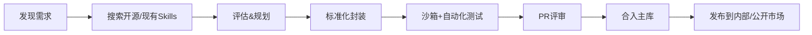

# 🚀 AI原生团队 Agent Skills 沉淀手册

> 将GitHub开源宝藏与团队隐性知识转化为可复用核心能力，让每个成员站在巨人肩膀上，实现跨平台共享与动态加载

---

## 一、核心理念

### 为什么要做Skills沉淀？

| 传统方式              | Skills化方式                          |
|-----------------------|---------------------------------------|
| 每次手动搜索解决方案  | 一次封装，永久复用、动态加载          |
| 依赖个人经验传承      | 知识结构化、可版本化、可继承          |
| 重复造轮子            | 站在开源巨人肩上 + 团队隐性经验固化    |
| 工具散落各处          | 统一技能库 + 开源市场共享             |
| 新人上手慢            | 即插即用，自然语言调用，秒级上手      |

### 核心公式（2026年主流实践）

```
需求 → AI搜索GitHub/开源社区 → Agent Skills标准化封装 → 沙箱调试 → 经验迭代固化 → 团队/公开共享（内部Innersource或开源市场）
```

> 💡 **2026趋势洞察**：Agent Skills已成为行业标准（Anthropic率先推出，后被Claude、Cursor、VS Code、GitHub Copilot、Vercel等广泛支持），强调模块化、可迁移、动态加载，支持跨AI平台复用，避免厂商锁定。

---

## 二、Skills分类体系

建议按功能领域 + 成熟度 + 类型（工具类/流程类）混合分类：

### 2.1 按功能领域分类（推荐monorepo结构）

```
skills/
├── media/                  # 多媒体处理
│   ├── video-downloader/   # 基于yt-dlp
│   ├── format-converter/   # 基于FFmpeg
│   └── image-upscaler/     # 基于Real-ESRGAN
│
├── dev-tools/              # 开发工具
│   ├── web-to-app/         # 基于Pake/Tauri
│   ├── code-review/        # 代码审查流程Skill（含最佳实践）
│   └── api-client/         # 基于httpie
│
├── data/                   # 数据处理
│   ├── csv-master/         # 基于csvkit/xsv
│   ├── json-master/        # 基于jq
│   └── ocr-master/         # 基于Tesseract
│
├── automation/             # 自动化流程
│   ├── web-archive/        # 基于ArchiveBox
│   ├── social-search/      # 基于sherlock
│   └── file-master/        # 文件整理+批量操作
│
├── ai-native/              # AI原生能力（高阶）
│   ├── whisper-transcribe/ # 语音转文字
│   ├── rembg-master/       # 图片去背景
│   └── math-animation/     # 基于manim
│
└── _meta/                  # 元技能（必备）
    ├── skills-manager/     # 技能管理器（自动更新+健康检查）
    └── skills-creator/     # 技能生成器
```

### 2.2 按成熟度分级（参考行业标准）

| 级别   | 状态     | 说明                           |
|--------|----------|--------------------------------|
| 🔴 Alpha   | 实验中   | 刚封装，未经充分测试           |
| 🟡 Beta    | 可用     | 基本稳定，可能有边缘问题       |
| 🟢 Stable  | 生产就绪 | 充分测试，含自动化测试         |
| ⭐ Core    | 核心能力 | 团队高频使用，已开源或内部共享 |

### 2.3 新增：按类型分类
- **工具类**：封装开源CLI/API（如yt-dlp）
- **流程类**：封装SOP、最佳实践（如代码审查规范、报告生成模板）

---

## 三、Agent Skills封装标准流程（2026最佳实践）

### 3.1 发现阶段

**Step 1: 需求明确**
```
我需要一个能够 [具体功能] 的工具
```

**Step 2: AI搜索开源项目**
```
推荐Prompt:
"有没有那种可以 [你的需求] 的GitHub上的开源项目，
要求：Star数较高、维护活跃、文档完善、支持容器化"
```

**推荐搜索工具优先级：**
1. Grok（擅长灰色地带）
2. Perplexity
3. ChatGPT GPT-5系列
4. Claude + 联网

**Step 3: 项目评估清单（升级版）**
- [ ] Star数 > 2000（优先）
- [ ] 最近3个月有更新
- [ ] 有清晰README + 示例
- [ ] 支持CLI/API（易封装）
- [ ] 依赖简单（优先纯Python/Rust）
- [ ] 许可证允许商用（MIT/Apache）
- [ ] 支持容器化（有Dockerfile优先）

### 3.2 封装阶段（遵循Agent Skills开源标准）

**Step 4: 启动封装**

```
推荐Prompt:
帮我把这个开源工具 [GitHub链接] 打包成一个Agent Skill。

要求：
1. 先分析项目结构和核心功能
2. 制定封装计划（遵循Anthropic标准）
3. 我确认后再开始开发

使用场景：[描述你的使用场景]
```

**Step 5: 执行封装**

- **规划阶段**：使用 Claude 4.5 Opus（规划能力强）
- **开发阶段**：确认计划后切换到开发模式

**推荐结构（兼容Anthropic/Claude/Cursor/VS Code）**

```
skill-name/
├── skill.md               # 核心！自然语言说明 + 使用示例 + 最佳实践（必须）
├── resources/             # 资源目录
│   ├── scripts/           # 执行脚本（Python/Shell）
│   │   ├── main.py
│   │   └── utils/
│   ├── config/            # 默认配置
│   │   └── default.yaml
│   ├── examples/          # 输入输出示例
│   └── docker/            # 可选：Dockerfile（推荐容器化）
├── tests/                 # 自动化测试（强烈推荐）
├── metadata.yaml          # 元数据（版本、关键词、依赖）
└── CHANGELOG.md
```

> ⚠️ **容器化推荐**：为复杂依赖Skill提供Dockerfile，确保跨环境一致性，避免"在我机器上能跑"问题。

> ⚠️ **跨平台提示**：团队如有Windows用户，脚本建议同时提供`.ps1`和`.sh`版本，或使用Python统一处理。

**skill.md模板（行业标准）**
```markdown
# Skill名称

## 目的与边界
[自然语言描述能解决什么问题、适用场景、不适用场景]

## 使用示例
输入：下载B站视频 https://...
输出：成功下载并转换格式

## 最佳实践与注意事项
- 使用代理避免限速
- Cookie处理方案
- 常见错误及解决方案

## 所需权限
- 网络访问
- 文件读写

## 依赖要求
- Python 3.10+
- FFmpeg

## 更新记录
- 1.0.0 (2026-01-21): 初始版本
```

### 3.3 调试阶段（升级安全实践）

**Step 6: 沙箱测试（新增）**
- 首次运行在Docker/虚拟机/云沙箱中执行
- 权限最小化原则
- 记录执行日志，便于审计

```
首次运行推荐模型：GPT 5.2 Codex
原因：解决问题更准确，工程能力强
```

**常见问题处理清单：**
- [ ] 依赖安装失败 → 检查网络/换源
- [ ] 权限问题 → 提升权限/修改路径
- [ ] 环境变量 → 添加到系统PATH
- [ ] Cookie/认证 → 导出浏览器Cookie
- [ ] 反爬机制 → 添加代理/Cookie
- [ ] 容器卷挂载路径问题 → 检查Docker volume配置

**Step 7: 经验固化**

```
推荐Prompt:
把刚才解决问题的经验都更新到 [skill-name] 这个skill里，
包括：
1. 需要预装的依赖
2. 环境配置要求
3. 常见问题解决方案
4. 沙箱测试结果
下次运行就不用再踩这些坑了
```

### 3.4 维护阶段（自动化升级）

**每月任务**
1. Skills Manager自动检查上游GitHub版本
2. 运行自动化测试
3. 同步更新并发布新版本（semver）
4. 推送至内部/公开Skills市场

---

## 四、团队协作规范（Innersource最佳实践）

### 4.1 Skills贡献流程



### 4.2 Skills Registry（增强版）

建议维护一个统一的技能注册表：

```yaml
# skills-registry.yaml
skills:
  - name: video-downloader
    version: 2.1.0
    status: core
    maintainer: 张三
    source: https://github.com/yt-dlp/yt-dlp
    description: 支持1000+站点视频下载（容器化部署）
    keywords: [视频, 下载, youtube, bilibili]
    platforms: [Claude, Cursor, VS Code]  # 兼容平台
    last_updated: 2026-01-20
    docker: true
    
  - name: format-converter
    version: 2.0.0
    status: stable
    maintainer: 李四
    source: https://github.com/FFmpeg/FFmpeg
    description: 万能格式转换器
    keywords: [转换, 视频, 音频, 图片]
    platforms: [Claude, Cursor, VS Code]
    last_updated: 2026-01-10
    docker: true
```

### 4.3 Skills Manager（元技能进阶功能）

建议团队第一个封装的就是**Skills管理器**，必备功能（2026推荐）：

- 自然语言搜索Skills
- 一键安装/更新（支持Docker拉取）
- 自动检测上游更新
- 健康检查（运行测试）
- 导出为开源格式（兼容Anthropic标准）
- 支持公开市场上传（如Skillsmp）

> 💡 **进阶玩法**：GitHub上有个 skill-seeker 项目，可以自动把GitHub仓库变成Skill，还能爬取产品文档转Skill。

### 4.4 安全与治理（行业重点）

| 风险类型       | 应对措施                           |
|----------------|------------------------------------|
| 恶意代码       | 只选高Star知名项目 + 代码审查      |
| 敏感数据泄露   | 不硬编码Key，使用环境变量          |
| 权限过大       | 沙箱执行 + 最小权限声明            |
| 依赖漏洞       | 定期扫描（trivy/dependabot）       |
| 厂商锁定       | 遵循开源Agent Skills标准           |

---

## 五、推荐封装清单（2026更新）

### 5.1 高价值开源项目Top20（基于当前Stars）

| 项目 | Stars | 用途 | 封装优先级 | 容器化 |
|-----|-------|-----|----------|--------|
| [yt-dlp](https://github.com/yt-dlp/yt-dlp) | 143k | 视频下载 | ⭐⭐⭐ | ✅ |
| [FFmpeg](https://github.com/FFmpeg/FFmpeg) | 47k | 音视频处理 | ⭐⭐⭐ | ✅ |
| [whisper](https://github.com/openai/whisper) | 75k | 语音转文字 | ⭐⭐⭐ | ✅ |
| [whisper.cpp](https://github.com/ggerganov/whisper.cpp) | 38k | 高效本地语音转文字 | ⭐⭐⭐ | ✅ |
| [ollama](https://github.com/ollama/ollama) | 100k+ | 本地LLM运行 | ⭐⭐⭐ | ✅ |
| [Tauri](https://github.com/tauri-apps/tauri) | 88k | 网页转桌面APP | ⭐⭐⭐ | ✅ |
| [Pake](https://github.com/tw93/Pake) | 45k | 轻量网页转APP | ⭐⭐⭐ | ✅ |
| [rembg](https://github.com/danielgatis/rembg) | 17k | 图片去背景 | ⭐⭐⭐ | ✅ |
| [tesseract](https://github.com/tesseract-ocr/tesseract) | 64k | OCR识别 | ⭐⭐⭐ | ✅ |
| [pandoc](https://github.com/jgm/pandoc) | 35k | 文档格式转换 | ⭐⭐⭐ | ✅ |
| [ImageMagick](https://github.com/ImageMagick/ImageMagick) | 12k | 图片处理 | ⭐⭐ | ✅ |
| [Real-ESRGAN](https://github.com/xinntao/Real-ESRGAN) | 30k | 图片超分辨率 | ⭐⭐ | ✅ |
| [ArchiveBox](https://github.com/ArchiveBox/ArchiveBox) | 23k | 网页归档 | ⭐⭐ | ✅ |
| [gallery-dl](https://github.com/mikf/gallery-dl) | 12k | 图库下载 | ⭐⭐ | ✅ |
| [sherlock](https://github.com/sherlock-project/sherlock) | 60k | 社交账号搜索 | ⭐⭐ | ✅ |
| [manim](https://github.com/3b1b/manim) | 70k | 数学动画生成 | ⭐⭐ | ✅ |
| [jq](https://github.com/jqlang/jq) | 31k | JSON处理 | ⭐⭐⭐ | - |
| [ripgrep](https://github.com/BurntSushi/ripgrep) | 50k | 极速搜索 | ⭐⭐ | - |
| [fzf](https://github.com/junegunn/fzf) | 67k | 模糊搜索 | ⭐⭐ | - |
| [cobalt](https://github.com/imputnet/cobalt) | 25k | 社交媒体下载 | ⭐⭐ | ✅ |

### 5.2 流程类Skills推荐（2026新增热门）

| Skill名称 | 用途 | 适用团队 |
|----------|------|---------|
| code-review | 代码审查规范与最佳实践 | 开发团队 |
| weekly-report | 周报自动生成（结合MCP拉取数据） | 全员 |
| swot-analysis | SWOT分析模板 | 产品/战略 |
| api-design | API设计规范检查 | 后端团队 |
| meeting-summary | 会议纪要自动生成 | 全员 |
| onboarding | 新人入职指引流程 | HR/团队 |

### 5.3 按场景推荐

**内容创作团队必备：**
- yt-dlp + gallery-dl（素材获取）
- FFmpeg + ImageMagick（素材处理）
- whisper/whisper.cpp（字幕生成）
- rembg（抠图）
- Real-ESRGAN（图片增强）

**开发团队必备：**
- Pake/Tauri（快速出桌面应用）
- pandoc（文档转换）
- jq（JSON处理）
- code-review Skill（规范流程）
- ollama（本地AI调试）

**数据团队必备：**
- [csvkit](https://github.com/wireservice/csvkit)（CSV处理瑞士军刀）
- [xsv](https://github.com/BurntSushi/xsv)（极速CSV处理）
- [visidata](https://github.com/saulpw/visidata)（终端数据浏览器）
- [datasette](https://github.com/simonw/datasette)（数据探索发布）

---

## 六、实施路线图（优化）

### Phase 1: 基础建设（Week 1-2）

- [ ] 搭建monorepo + Skills Registry
- [ ] 封装 skills-creator（核心）
- [ ] 封装 skills-manager（管理）
- [ ] 制定命名规范和目录结构

### Phase 2: 核心能力（Week 3-4）

- [ ] 封装8个核心工具类Skills（优先容器化）
- [ ] 建立自动化测试流程
- [ ] 团队内部培训

### Phase 3: 扩展覆盖（Month 2）

- [ ] 各部门贡献流程类Skills
- [ ] 按优先级持续封装
- [ ] 接入公开Skills市场

### Phase 4: 持续运营（长期）

- [ ] 月度Skills健康检查
- [ ] 季度审计与清理
- [ ] 参与开源Skills社区贡献

---

## 七、FAQ（更新）

**Q: 现在还叫Skill吗？**
> 2026年行业统一称为"Agent Skills"，结构标准化，支持跨平台迁移。

**Q: Skills和MCP有什么区别？**
> MCP是点对点精确封装，Skills是语义化模糊封装。Skills让AI自己做匹配，使用更自然。

**Q: 是不是所有GitHub项目都能封装？**
> 不是。需要命令行接口或API的项目最适合。纯GUI项目不适合Skills化。

**Q: 要不要全部容器化？**
> 推荐复杂依赖Skill容器化，简单Python脚本可直接运行。

**Q: 怎么避免厂商锁定？**
> 严格遵循开源Agent Skills标准，可一键迁移到Claude/Cursor/VS Code等。

**Q: Skills市场有什么用？**
> 可上传优秀Skills到公开市场（如Skillsmp），团队内部也可建私有市场。

**Q: Skills太多会不会混乱？**
> 会。所以需要：1）合理分类；2）清晰命名；3）Skills管理器；4）定期清理。

**Q: Token消耗会不会很大？**
> 初期会多一些，但随着Skills成熟和缓存，后期消耗会大幅降低。而且Token会越来越便宜。

**Q: 怎么让新人快速上手？**
> 1）完善的skill.md文档；2）使用示例；3）Skills管理器的自然语言查询。

**Q: 上游项目更新了怎么办？**
> Skills Manager可以定期扫描上游仓库版本，发现更新后提示维护者同步。建议每月检查一次核心Skills。

**Q: 团队成员不会科学上网怎么办？**
> 1）搭建内部镜像仓库；2）将Skills打包到内网Git；3）核心依赖预下载离线包；4）使用Docker离线镜像。

**Q: Skills和传统脚本库的区别？**
> Skills = 脚本 + 文档 + 经验 + 语义化调用 + 跨平台标准。传统脚本需要记住命令，Skills只需自然语言描述需求。

---

## 八、附录

### A. 推荐工具链（2026）

| 用途         | 推荐工具                     |
|--------------|------------------------------|
| Skills开发   | Claude Code / Cursor / OpenCode |
| 规划阶段模型 | Claude 4.5 Opus              |
| 开发阶段模型 | Claude 4.5 Opus              |
| 首次运行模型 | GPT 5.2 Codex                |
| 容器化       | Docker + ollama（本地AI）    |
| 项目搜索     | Grok / Perplexity            |
| 标准参考     | github.com/anthropics/skills |

### B. 快速开始模板（skill.md）

```markdown
# [Skill名称]

## 基本信息
- **基于项目**: [GitHub链接]
- **版本**: 1.0.0
- **状态**: 🟡 Beta
- **维护者**: [姓名]
- **兼容平台**: Claude, Cursor, VS Code

## 目的与边界
[自然语言描述能解决什么问题、适用场景、不适用场景]

## 使用示例
输入：[自然语言描述]
输出：[预期结果]

## 最佳实践与注意事项
- [注意事项1]
- [注意事项2]

## 所需权限
- 网络访问
- 文件读写

## 依赖要求
- [依赖1]
- [依赖2]

## 常见问题
### Q1: [问题]
> [解决方案]

## 更新记录
- 1.0.0 (2026-01-21): 初始版本
```

---

> 💡 **2026核心提醒**：不止封装工具，更要沉淀"隐性经验"和"判断标准"。Agent Skills让团队知识真正成为可复用、可共享、可演化的核心资产。

**Let's build a truly AI-native team with standardized Agent Skills! 🚀**
